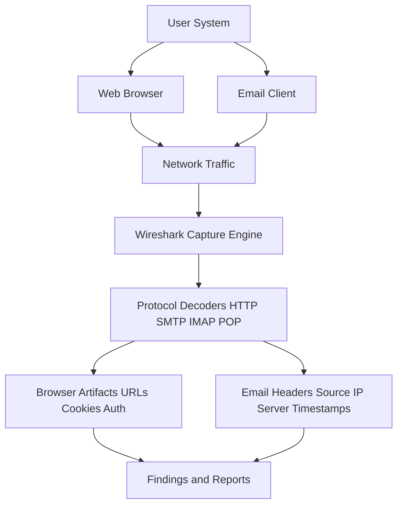
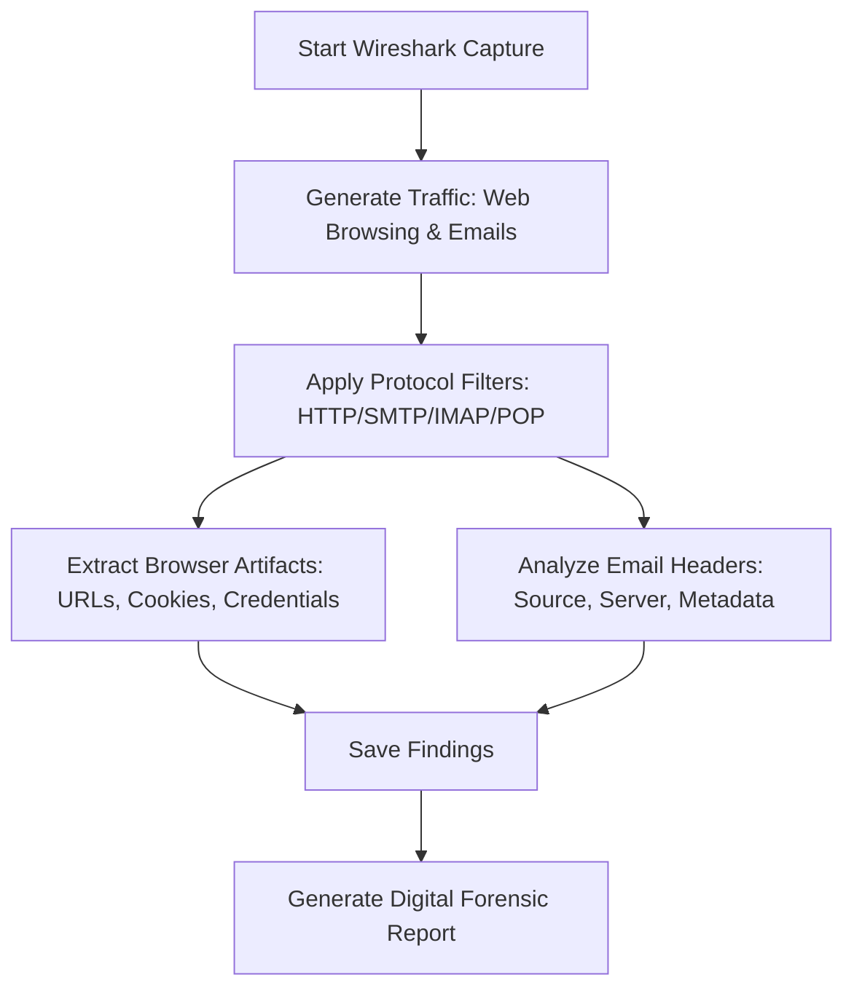

# Ex 10 Using-Wireshark---analyzing-web-browser-artifacts-email-header-analysis
## AIM:
To use Wireshark to analyze web browser activities and inspect email headers from captured network traffic.
## Architecture Diagram:

## DESIGN STEPS:
### Step 1:
- Install Wireshark and ensure correct network adapter selection.
- Enable packet capturing for your active interface (Wi-Fi/Ethernet).

### Step 2:
**Web Browser Artifact Analysis**
- Open a browser and visit websites with login forms (use dummy credentials).
- In Wireshark, filter traffic with:
    - ```http``` for normal HTTP requests
    - ```http.cookie``` for cookies
    - ```http.authbasic``` for basic authentication
- Identify:
    - URLs visited
    - GET/POST requests
    - Cookies & session IDs
    - Credentials (if plaintext HTTP is used)
### Step 3:
- Capture email traffic by sending/receiving emails (dummy mail server or provided PCAP).
- Use filters:
    - ```smtp``` (Simple Mail Transfer Protocol)
    - ```pop``` / ```imap``` (for received mail)
- Inspect email headers:
    - Source IP
    - Mail server hostname
    - Timestamps
    - Possible forged headers
## PROGRAM:


## A. Capturing Traffic in Wireshark

1. Open Wireshark and start capturing on the active interface (Wi-
Fi/Ethernet).


2. Perform activities like opening a website or sending an email through a
client (e.g., Gmail via browser or Thunderbird).


3. Stop the capture once done.

## B. Analyzing Web Browser Artifacts
1. Apply filters like: http, tcp.port == 443 (for HTTPS), or dns to isolate
browser traffic.


2. Inspect HTTP GET/POST requests:
o Look for URLs, hostnames, user agents, and cookies in the HTTP
headers.
o Follow TCP Stream to reconstruct page request flow:
▪ Right-click a packet → Follow → TCP Stream.


3. Analyze DNS Queries:
o Filter: dns
o Reveal domains the browser tried to resolve.


## C. Email Header Analysis
1. Apply relevant filters:
o For POP3: tcp.port == 110
o For SMTP: tcp.port == 25 or 587
o For IMAP: tcp.port == 143 or 993


2. Locate email data:
o Look for SMTP packets to see sender/receiver email addresses.
o Use "Follow TCP Stream" to view the full email headers and body if
unencrypted.


3. Extract Email Header Fields:
o Analyze From, To, Subject, Date, Message-ID, and relay servers used
in sending the email.


## OUTPUT:
Captured Web Activity and Email Header Information

## RESULT:
Web browser artifacts and email headers were successfully analyzed using Wireshark.

